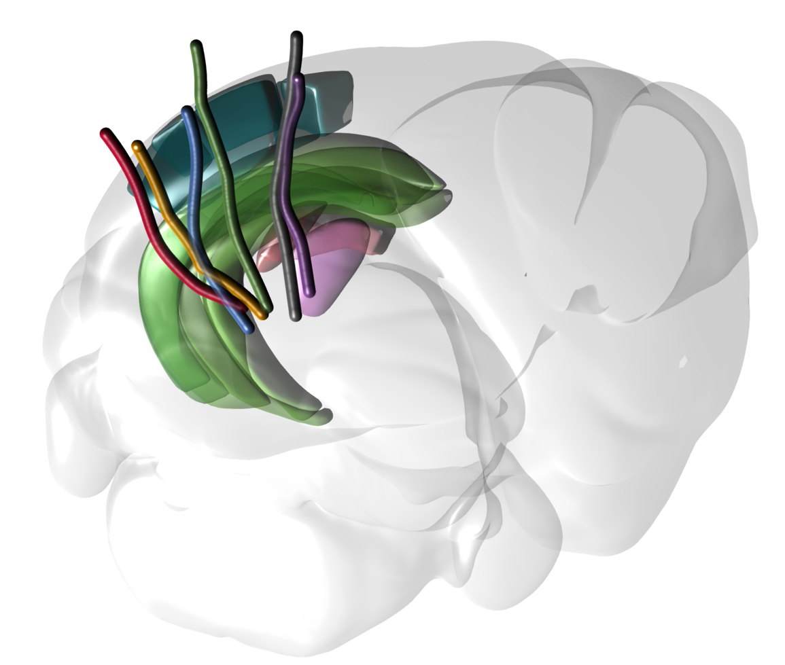

# AllenNeuropixels

<!--  -->

This package contains high-level analysis and visualization tools for the Allen Neuropixels mouse electrophysiology datasets ([Visual Coding](https://portal.brain-map.org/circuits-behavior/visual-coding-neuropixels) and [Visual Behavior](https://portal.brain-map.org/circuits-behavior/visual-behavior-neuropixels)) in Julia.
It also re-exports low-level functions for accessing and formatting the data ([AllenNeuropixelsBase.jl](https://www.github.com/brendanjohnharris/AllenNeuropixelsBase.jl)) and bindings to the Python [AllenSDK](https://github.com/AllenInstitute/AllenSDK) ([AllenSDK.jl](https://www.github.com/brendanjohnharris/AllenSDK.jl)).

