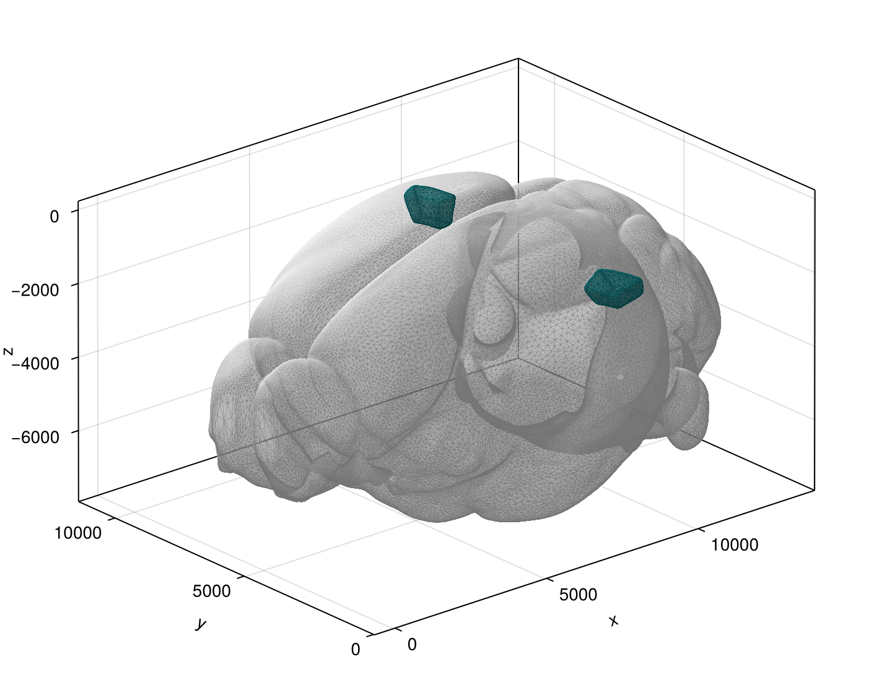
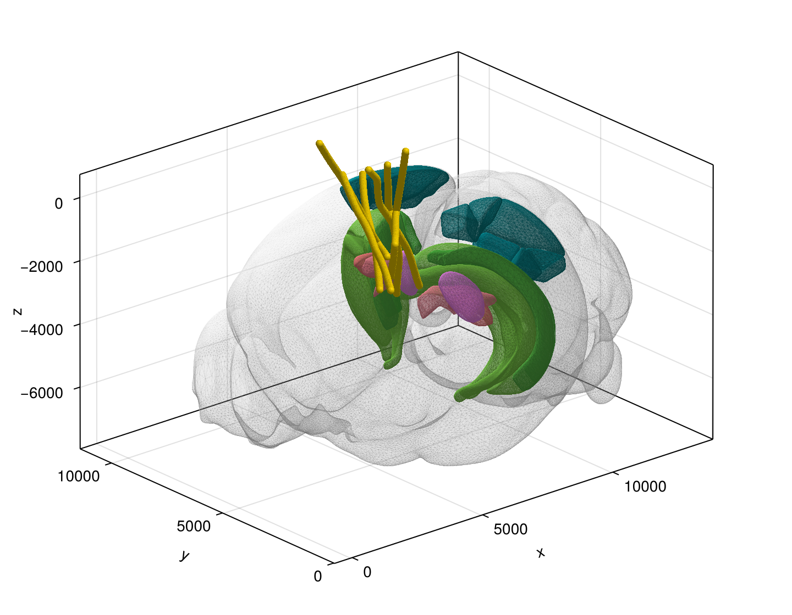

```@meta
CurrentModule = AllenNeuropixels
```

# AllenNeuropixels

AllenNeuropixels.jl is a Julia package for loading, analyzing, and visualizing data from the Allen Neuropixels mouse electrophysiology datasets ([Visual Coding](https://portal.brain-map.org/circuits-behavior/visual-coding-neuropixels) and [Visual Behavior](https://portal.brain-map.org/circuits-behavior/visual-behavior-neuropixels)).

## Features

- Load, filter, and partition LFP and spike-band data (see [AllenNeuropixelsBase.jl](https://www.github.com/brendanjohnharris/AllenNeuropixelsBase.jl))
- Calculate channel and unit depths (along the probe length, or along atlas streamlines)
- ICA, PCA, CCA, spectral (including FOOOF), wavelet, and burst-based analysis
- Visualize spike rasters, wavelet spectrograms, burst masks, and 3D renders of the mouse reference atlas (including probe locations)

## Examples

Below we provide some basic examples for Visual Coding dataset.

### Installing and initializing

To install AllenNeuropixels.jl and set a custom directory for data downloads (the default is a scratchspace):

```julia
using Pkg
Pkg.add("AllenNeuropixels") # Please see the AllenSDK.jl readme for any python-related troubles
import AllenNeuropixels as AN
AN.setdatadir("~/Downloads/AllenNeuropixelsData/") # Then restart Julia
```

### Listing sessions

The dataset is divided into recording sessions, each with a unique ID. Sessions last for about 3 hours and follow standardized stimulus templates. One mouse can have multiple recording sessions. To access the session table (containing metadata such as session id, session type, mouse age, genotype, etc.) and select a session by id:

```julia
seshtable = AN.getsessiontable() # Or AN.VisualBehavior.getsessiontable() for the Visual Behavior dataset
sessionid = seshtable[1, :id]
session = AN.Session(sessionid) # This can take a few moments
```

An instance of the `AN.Session` type holds the python objects for a given session that interface with the [AllenSDK](https://github.com/AllenInstitute/AllenSDK).

### Querying probes, channels, epochs, and stimuli

The recording for each session are made synchronously across six probes, each with hundreds of channels. To retrieve the probe metadata, channel metadata, and stimulus metadata for a given `AN.Session`:

```julia
probes = AN.getprobes(session) # Can also be AN.getprobes() to list all probes in the Visual Coding dataset
channels = AN.getchannels(session) # Or AN.getchannels()
epochs = AN.getepochs(session) # A Dataframe of stimulus epoch metadata
stimuli = AN.getstimuli(session) # A Dataframe for individual stimulus presentations
```

### Loading LFP data

To load the LFP data for a particular session, during a particular stimulus epoch (see `epochs.stimulus_name`), for channels in a particular brain region (structure; see `channels.ecephys_structure_acronym`):

```julia
LFP = AN.formatlfp(session; stimulus="flashes", structure="VISl")
```

This will return a [`TimeSeries`](https://www.github.com/brendanjohnharris/TimeseriesTools.jl) containing LFP data with (rectified) timestamps and channel ids. The raw LFP (with original timestamps) can be accessed using `AN.getlfp`.
To calculate depths for the LFP channels:

```julia
using TimeseriesTools
channelids = lookup(LFP, Chan)
probedepths = AN.getchanneldepths(session, channelids; method=:probe) # From the cortical surface along probe depths (μm)
streamlinedepths = AN.getchanneldepths(session, channelids; method=:streamlines) # Along streamlines (%)
```

### Loading spike data

To load a dictionary of spike times for a given session and structure, use:

```julia
spikes = AN.getspiketimes(session, "VISl")
probeid = TimeseriesTools.metadata(LFP)[:probeid]
spikedepths = AN.getunitdepths(session, probeid, keys(spikes); method=:streamlines)
```

These spikes trains can then be aligned to different stimuli using information from the metadata tables above.

### Plotting

With `Makie` loaded, you can access the plotting utilites (`src/Plots/`). For example, you can plot the CCFv3 structure meshes with:

```julia
using CairoMakie
D = AN.getstructureidmap()
root = D["root"] # The whole brain
VISl = D["VISl"] # One structure

f = Figure(; size = (720, 560))
ax = Axis3(f[1, 1]; aspect = :data)
p = AN.Plots.plotbrainstructure!(ax, root; hemisphere=:both)
p = AN.Plots.plotbrainstructure!(ax, VISl; hemisphere=:both)
f
```

Or, for a more complete plot, with the Neuropixels probes:
```julia
f = Figure(; size = (720, 560))
ax = Axis3(f[1, 1]; aspect = :data)
p = AN.Plots.plotbrain!(ax, session; hemisphere=:both, dotext=false)
f
```

